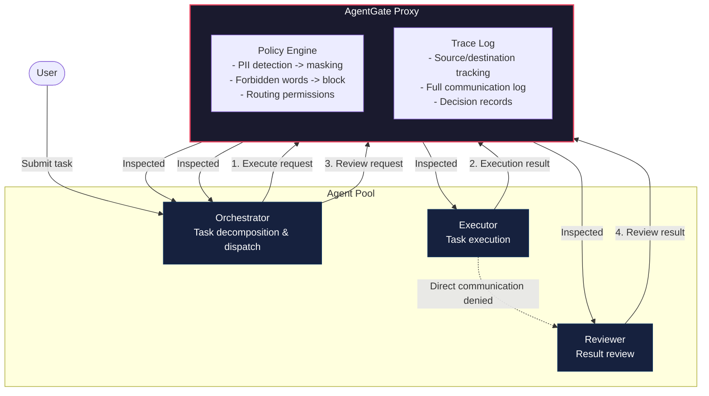
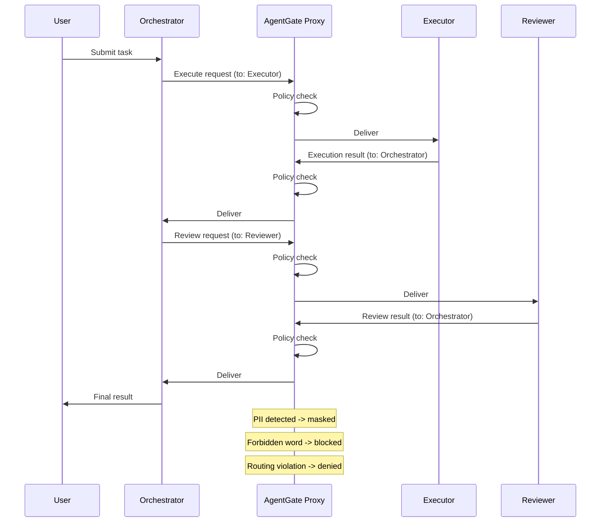

# AgentGate Multi-Agent Security Demo

A technical demo proving that AgentGate acts as a consistent
security and governance layer across multiple AI agents.

## Architecture



## Communication Flow



## Demo Scenarios

| # | Scenario | Description | Expected |
|---|----------|-------------|----------|
| 1 | Normal Flow | Orchestrator -> Executor -> Reviewer collaboration | All ALLOW |
| 2 | PII Masking | Message containing email, phone, credit card | PII replaced with `***` |
| 3 | Forbidden Word | SQL injection payload | Message BLOCKED |
| 4 | Routing Violation | Executor -> Reviewer direct communication | Routing BLOCKED |

## Setup

```bash
cd demos/multi_agent
pip install -r requirements.txt
```

## Usage

### CLI Mode (recommended)

```bash
python3 main.py
```

Interactive slideshow — press Enter to advance through each scenario.
Trace log summary is displayed at the end.

### HTTP API Mode

```bash
uvicorn gate_proxy:app --port 8200
```

```bash
# Register agent
curl -X POST http://localhost:8200/agents/register \
  -H "Content-Type: application/json" \
  -d '{"agent_id": "orchestrator", "role": "orchestrator"}'

# Relay message
curl -X POST http://localhost:8200/relay \
  -H "Content-Type: application/json" \
  -d '{
    "from_agent": "orchestrator",
    "to_agent": "executor",
    "payload": "test message"
  }'

# View trace log
curl http://localhost:8200/trace
```

### Tests

```bash
pytest test_demo.py -v
```

## File Structure

```
demos/multi_agent/
├── README.md           # This file
├── requirements.txt    # Dependencies
├── policies.yaml       # Security policy definitions
├── gate_proxy.py       # AgentGate Proxy implementation
├── agents.py           # Agent definitions (Orchestrator/Executor/Reviewer)
├── main.py             # Interactive demo script
└── test_demo.py        # Test suite
```

## Policy Configuration

`policies.yaml` controls the following:

- **PII patterns**: Email, phone number, credit card, SSN, national ID
- **Forbidden words**: SQL injection, XSS, dangerous shell commands, confidential keys
- **Masking mode**: `mask` (replace and continue) / `block` (reject message)
- **Routing permissions**: Per-agent send-to restrictions
- **Message size limits**: Per-agent maximum payload size
